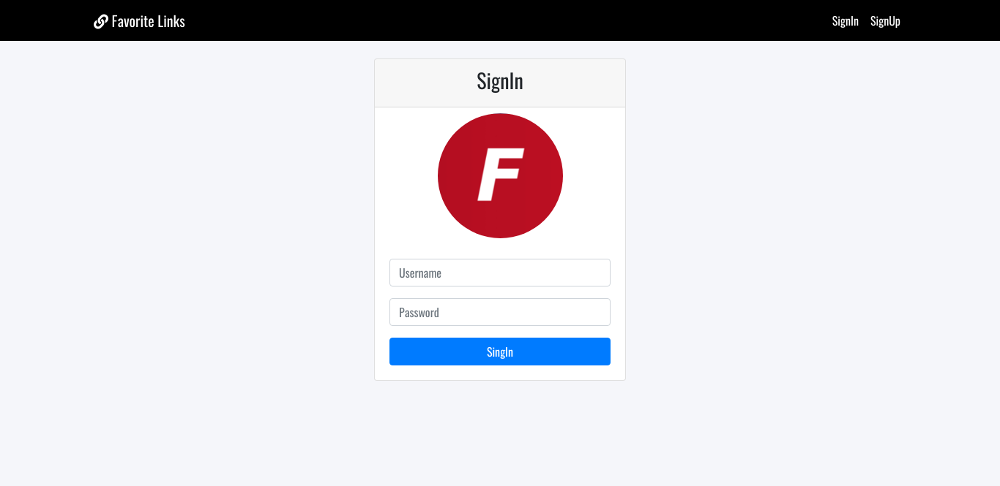

# Notes App with Nodejs and Mysql

Notes App is a Multi Page Application using Nodejs and Mysql.



### Installation
```
mysql -u MYUSR "-pMYPASSWORD" < ./database/db.sql # create database
npm i
npm run build
npm start
```

## File Structure

- database, it the folder with all the sql queries, you can use to recreate the database for this application
- src, it's all the code for the Backend and Frontend Application
- docs

## Environment Variables

- PORT


## Tools

- Nodejs
- Mysql
- Babel
- Docker


